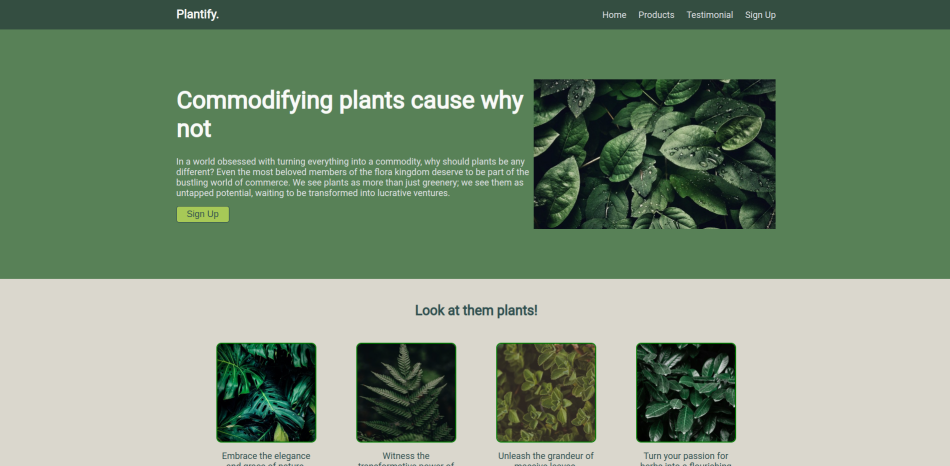

# Plantify Landing Page

This project demonstrates a landing page for Plantify using HTML and CSS as part of The Odin Project.

## Screenshots

## Credits

#### Images

Close-Up Photography of Leaves With Droplets by [Sohail Nachiti](https://www.pexels.com/@sohi/), via [Pexels](https://www.pexels.com)

Close-up Photo of Green Leafed Plant by [Aditya Aiyar](https://www.pexels.com/@aditya-aiyar-615049/), via [Pexels](https://www.pexels.com)

Green Fern Leaves in Close Up Photography by [Joel Arts](https://www.pexels.com/@joe-arts-1830507/), via [Pexels](https://www.pexels.com)

Green Leaves Plants by [Lucas Pezeta](https://www.pexels.com/@lucaspezeta/), via [Pexels](https://www.pexels.com)

Close-Up Photo of Leaves by [Garrett Morrow](https://www.pexels.com/@garrettmorrow/), via [Pexels](https://www.pexels.com)

## License

This project is licensed under the terms of the [GPL](https://www.gnu.org/licenses/gpl-3.0.en.html) open source license.
